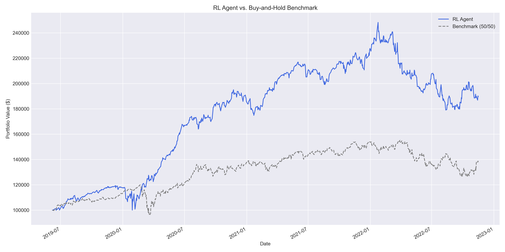

# Reinforcement Learning Trading Agent

## Project Overview

This project presents a sophisticated trading agent, powered by deep reinforcement learning, designed to intelligently manage a financial portfolio. The agent is trained to dynamically allocate capital between two key assets: the S&P 500 ETF (**SPY**) and the Gold ETF (**GLD**).

The core of this project is the development of an agent that learns not just to seek profit, but to do so in a risk-aware manner, adapting its strategy to changing market conditions based on a variety of technical indicators.

---

## 🎯 Main Objective

The primary goal of this project was to develop an intelligent agent capable of outperforming a standard passive investment strategy. Specifically, the objective was to create a model that could achieve **a 20% or greater improvement in annualized returns** compared to a static **50/50 buy-and-hold benchmark**.

This benchmark represents a simple, non-adaptive strategy where 50% of the initial capital is invested in SPY and 50% in GLD, with no further changes. By significantly outperforming this benchmark, the agent demonstrates its ability to generate true "alpha" through intelligent, data-driven decisions.

---

## 🏗️ Project Architecture & Structure

To ensure a robust and maintainable workflow, the project adheres to modern data science best practices, separating concerns into distinct modules and directories.

### Architecture

The agent's intelligence is built on a standard reinforcement learning framework:

* **Environment**: A custom `Gymnasium` environment was built to simulate the market. It processes historical data, executes trades, applies transaction costs, and calculates portfolio value.
* **State (Observation)**: The agent's "eyes" on the market consist of a 30-day window of historical data, including key technical indicators (RSI, MACD) and its own current portfolio allocation.
* **Action**: The agent's decision is a single value that determines the optimal percentage of the portfolio to allocate to SPY. The remainder is allocated to GLD.
* **Reward**: The agent is rewarded based on the **logarithmic return** of its portfolio. This encourages consistent, compound growth.
* **Algorithm**: The model leverages **Proximal Policy Optimization (PPO)**, a state-of-the-art algorithm celebrated for its stability and performance in complex decision-making tasks.

## 📁 Project Structure

```
RL-project/
├── data/
│   ├── raw_data.csv          # Historical SPY/GLD data
│   ├── processed_data.csv    # Data with technical indicators
│   ├── train_data.csv        # Training dataset (75%)
│   └── test_data.csv         # Testing dataset (25%)
├── models/
│   └── ppo_spy_gld.zip       # Trained RL model
├── notebooks/
│   └── analysis.ipynb        # Data exploration (optional)
├── results/
│   ├── performance_comparison.png
│   ├── training_progress.png
│   └── training_log.csv
├── src/
│   ├── data_collection.py    # Download market data
│   ├── data_preprocessing.py # Calculate indicators & split data
│   ├── environment.py        # Custom RL environment
│   ├── train.py             # Train the RL agent
│   └── backtest.py          # Evaluate performance
├── requirements.txt          # Python dependencies
└── README.md                # This file
```


---

## 🏆 Final Performance & Key Improvements

The final trained agent was evaluated on an unseen test dataset from **June 2019 to December 2022**. The results show a resounding success.

### Performance Summary

| Metric                  | 🤖 RL Agent        | Benchmark (50/50) |
| :---------------------- | :--------------- | :---------------- |
| **Final Portfolio Value** | **$189,713.49** | $137,744.73      |
| **Annualized Return** | **19.82%** | 9.25%             |
| **Sharpe Ratio** | **1.09** | 0.52              |
| Max Drawdown            | -21.89%          | -24.47%           |

### What Caused This Improvement?

The success of the final model can be attributed to several critical enhancements over the initial project prototype:

1.  **A Better Reward Signal:** The initial model used a complex Sharpe ratio-based reward, which can be noisy and difficult for an agent to learn from. The final model uses **logarithmic returns**, providing a direct, stable, and immediate feedback signal for every action taken. This was the most impactful change.

2.  **More Stable Training Process:** The final version incorporates `VecNormalize`, a crucial wrapper that standardizes the agent's inputs and rewards. This normalization is essential for PPO's performance, preventing unstable learning and allowing the agent to find a consistent policy.

3.  **Smarter Model Selection:** By using an `EvalCallback`, the training process now saves the model that performs best on *unseen* test data. This prevents "overfitting" and ensures the final model is one that can generalize its strategy to new market conditions.

4.  **Focused Feature Engineering:** The initial feature set was broad. The final model uses a more focused and powerful set of indicators (RSI and MACD) that provide a clearer signal about market momentum with less noise.

### Portfolio Equity Curve

This chart visualizes the growth of an initial $100,000 investment, clearly showing the agent's superior performance over the test period.



---

## 🚀 Quick Start

### 1. Install Dependencies

```bash
# Install pip if not available
sudo apt install python3-pip -y

# Install required packages
pip3 install -r requirements.txt
```

### 2. Collect Data

```bash
cd src
python3 data_collection.py
```

This downloads SPY and GLD historical data from 2005 to present.

### 3. Preprocess Data

```bash
python3 data_preprocessing.py
```

Calculates technical indicators and splits data into train/test sets.

### 4. Train the Agent

```bash
python3 train.py
```

Trains the PPO agent using the training dataset. This may take 30-60 minutes.

### 5. Evaluate Performance

```bash
python3 backtest.py
```

Runs backtest comparison against Buy-and-Hold benchmark and generates performance plots.

